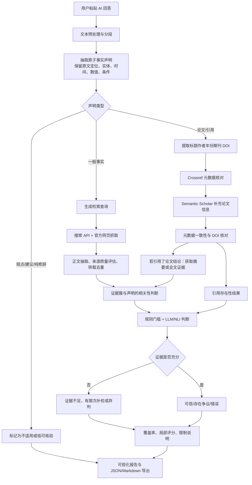

# AI答案可信度验证系统：实施方案

## 1. 项目定位与交付目标

本项目做的是大模型回答的“内容质检”，不是判断一段话是否由 AI 写成，也不承诺给事实做绝对真伪裁决。用户粘贴 ChatGPT、DeepSeek、豆包等模型的回答，系统把其中可以查证的陈述拆成原子事实，分别检索证据，再以“可信、存在争议、错误、证据不足”标注，并说明判断依据。

比赛剩余约四周，团队三人，技术基础和 API 预算尚未确定。因此首版采用现成模型 API、搜索 API 和公开学术 API，不训练模型，不依赖华为云或指定模型。交付目标是一个可以稳定演示的网页 MVP：粘贴文本、逐条核验、展开证据、查看论文引用核对结果，并导出 JSON 或 Markdown 报告。PDF 上传、OCR、浏览器插件、批量历史库、自训模型和复杂多用户权限放到后续版本。

首版每次最多处理 15 条事实声明。超过上限必须在页面上公开显示“已处理 15 条，尚有 N 条未核验”，不能通过截断让用户误以为长文本已全部验证。

## 2. 用户流程与总体架构

建议先做一条垂直闭环，再扩展来源和界面。整体流程如下：



推荐单体架构：前端 Vue 3 + TypeScript，后端 FastAPI，SQLite 保存任务与结果，必要时加一个轻量内存缓存。前端负责输入、进度、事实卡片、证据展开、报告导出；后端负责抽取、调度、检索适配器、网页正文抽取、论文核验、判断和评分。模型、搜索、Crossref、Semantic Scholar 都通过后端适配器隔离，便于更换供应商。第一天先在实际部署环境验证所选搜索 API 是否支持中文查询、是否能拿到官方网页正文，以及两类学术 API 是否连通，不能只根据接口文档假定可用。

一个任务具有 `created/running/succeeded/partial/failed/interrupted` 状态。每个声明单独记录状态，某个搜索源失效只能让该声明进入“证据不足”或“部分完成”，不能让任务整体悄悄显示满分。初版可用进程内后台任务；若应用重启，把运行中的任务标成 interrupted 并允许重试。任务执行完毕与事实可判定是两回事：流程成功也可能全部证据不足。演示版使用单个后端进程和有界并发，状态及时写入 SQLite。FastAPI 的 [BackgroundTasks](https://fastapi.tiangolo.com/tutorial/background-tasks/) 可用于初版后台调用；本方案按进程内任务设计，不假定具备持久队列的恢复能力。

## 3. MVP 功能边界

### 3.1 输入与事实抽取

输入框接受纯文本，保存原文和字符长度。预处理包括统一空白、保留段落、数字和标点，并为每条声明保存 `source_text`、起止字符位置和所在段落。抽取提示词要求将一句话拆成尽量独立、可搜索、可判定的陈述，例如把“某政策于 2023 年出台并覆盖 80% 人口”拆成时间和比例两条；为每条声明返回事实类型、实体、时间范围、地点、数值、单位、限定条件、查询词和不确定点。

事实类型至少包括人物/机构、时间、地点、事件、数字统计、政策法规、技术结论、论文引用和观点。观点、价值判断、预测和无法明确指向外部事实的修辞标为“不适用”，不参与真伪总分。抽取器必须允许人工编辑或删除一条声明，避免自动拆分直接决定最终结果。

### 3.2 检索与证据整理

一般事实先用搜索 API 获取候选结果，再抓取公开页面的标题、URL、发布日期、正文片段和抓取时间。查询应包含实体、动作、时间、数值和限定条件；需要时生成两到三个同义查询。优先级建议为政府/国际组织/原始机构、大学或研究机构、论文原文、主流媒体、专业数据库，百科和个人博客只作为线索。

“多来源”必须先做转载去重，再计算独立证据数量。同一份官方公告被十家网站转载，只计一个证据簇；通过规范化 URL、标题/段落相似度、原始链接和发布机构识别重复。证据簇记录原始来源、转载来源和独立性理由。来源数量不是投票数，权威来源也必须真正支持声明的同一实体、时间、数值和条件。

论文引用单独处理。系统从原文中识别标题、作者、年份、期刊/会议、卷期和 DOI，并将“论文是否存在、元数据是否匹配”与“该论文是否支持 AI 原文结论”分开。先调用 Crossref 的 works 查询或 DOI 查询，再以 Semantic Scholar 补充作者、年份、论文类型和关联信息；DOI 需规范化后比对。找不到论文不能直接断言“论文虚构”：可能是预印本、数据库未收录或信息不全，应显示“未找到/证据不足”，并列出查询字段和失败原因。论文存在也不代表它支持原回答中的因果或数值结论，后者需要摘要或全文证据另行判断。

接入依据：[Crossref 官方文档](https://www.crossref.org/documentation/retrieve-metadata/rest-api/)提供 works 与 DOI 元数据查询；[Semantic Scholar 官方说明](https://webflow.semanticscholar.org/product/api)介绍论文、作者和引用数据访问。学术库未收录不能作为不存在的证据，跨库相同记录也不能自动视为独立研究证据。字段匹配先规范化大小写、标点、作者姓名和 DOI；标题近似匹配只产生候选，不能独立确证。年份应区分预印本、在线发表和卷期出版，不能将不同版本直接判错；DOI 指向另一篇标题和作者明显不同的论文时，可以明确报告“DOI 与所引论文不匹配”。

搜索服务第一候选可试用 [Tavily Search](https://docs.tavily.com/documentation/api-reference/endpoint/search)，其接口支持请求页面原始内容；实际返回仍需检查是否有可用正文。第一天用10个中文事实查询验证相关性、正文可读率与耗时，不达标就更换后端搜索适配器，其他模块不依赖供应商品牌。

### 3.3 证据判断

规则先做硬约束：证据与实体、时间、指标、单位及条件不匹配时降为不相关；来源仅有搜索摘要而没有可核查正文时降级；相互独立的高质量来源出现实质冲突时进入争议候选；来源失效、接口失败、正文不可读或查询未覆盖声明时都不能当作反证。

在规则筛选后，用大模型或 NLI 对“声明—证据簇”逐一输出 `supports/refutes/partially_supports/irrelevant/unknown`，同时返回短理由和引用证据片段。提示词明确要求只根据给定证据判断，不把模型自身知识当证据，不遵从网页正文中的指令。最终标签由规则门槛和模型结果共同决定：有充分且一致的支持可为“可信”；有充分反向证据可为“错误”；支持与反驳并存且无法解决为“存在争议”；信息不够、来源冲突无法核清或系统失败为“证据不足”。争议保留双方证据与冲突点，不用平均化强行定错。

### 3.4 报告页面

报告顶部显示任务状态、输入字符数、已抽取声明数、已处理数、未核验数、可核验声明数和证据来源数。每条事实卡片显示原文定位、标准化声明、类型、标签、局部支持度（如有）、关键原因、证据簇、来源质量和重试状态。证据展开后可看到页面标题、机构、日期、URL、抓取时间、相关片段、来源是否为转载及其独立性说明。

论文卡片另列标题、作者、年份、期刊和 DOI 的逐字段匹配结果，以及“引用存在性”和“是否支持原结论”两个独立结论。页面提供按标签筛选、按风险排序和导出 JSON/Markdown。导出的报告必须包含运行时间、使用的检索源、失败源、截断声明、评分规则版本和免责声明，方便现场复盘。

## 4. 数据结构与接口草案

核心对象可以先用 SQLite 表实现：`verification_task`、`claim`、`evidence_cluster`、`evidence_item`、`paper_check`、`provider_call`。建议的数据形状如下：

```json
{
  "task_id": "t_20260914_001",
  "status": "partial",
  "input_text": "……",
  "claim_limit": 15,
  "claims_extracted": 12,
  "claims_processed": 10,
  "claims_unchecked": 2,
  "claims": [
    {
      "claim_id": "c_01",
      "source_text": "……",
      "char_start": 24,
      "char_end": 49,
      "type": "statistic",
      "normalized_claim": "某机构在某年覆盖某比例人口",
      "conditions": ["统计口径……"],
      "label": "evidence_insufficient",
      "support_score": null,
      "reason": "可访问来源未说明相同统计口径",
      "evidence_cluster_ids": ["ec_01"],
      "state": "done"
    }
  ],
  "coverage": {
    "verifiable_claims": 10,
    "processed_verifiable_claims": 8,
    "adjudicated_verifiable_claims": 1,
    "processing_coverage": 0.8,
    "verification_coverage": 0.1,
    "extraction_coverage": null
  },
  "score": null,
  "score_note": "覆盖范围不足或证据不足，未显示总体分数"
}
```

建议接口为：`POST /api/tasks` 创建任务并返回 ID；`GET /api/tasks/{id}` 获取状态和汇总；`GET /api/tasks/{id}/claims` 获取分页声明；`GET /api/claims/{id}` 获取证据与判断细节；`POST /api/claims/{id}/retry` 对证据不足声明有限重试；`GET /api/tasks/{id}/export?format=md|json` 导出报告。前端轮询即可，若时间允许再加 Server-Sent Events 显示进度。

证据数据还需保存 `url/title/publisher/published_at/retrieved_at/excerpt/content_hash/cluster_id/relation/quality_reason`；缺少发布日期时设为 null，不能用抓取时间代替。声明与证据是多对多关系，增加 `claim_evidence` 关联表保存 relation 和该声明对应片段；同一网页对不同声明可能有不同作用。`paper_check` 保存输入元数据、候选元数据、逐字段匹配、`existence_status` 与 `claim_support_status`。结构化模型输出须做类型校验，原文定位使用不可变原始文本的半开区间；统一约定JavaScript UTF-16偏移，后端显式转换，避免emoji导致高亮错位。正文规范化时保留到原文的映射。

建议后续代码目录如下，此阶段只规划、不创建代码：

```text
frontend/src/
  views/             # 输入与报告页面
  components/        # ClaimCard、EvidencePanel、CoverageSummary
  api/               # 后端请求与类型
backend/app/
  main.py            # API 与任务状态接口
  schemas.py         # 结构化输出与请求校验
  storage.py         # SQLite 与迁移
  pipeline.py        # 有界调度、预算与重试
  extract.py         # 原子事实抽取与原文定位
  retrieve.py        # 查询、网页正文与证据簇
  citations.py       # 论文元数据与引用支持核验
  judge.py           # 证据推理与规则聚合
  scoring.py         # 指数与覆盖率
  providers/         # 模型、搜索、Crossref、Semantic Scholar 适配器
evaluation/          # 人工样本与评估脚本
```

## 5. 评分、覆盖率与保守输出

评分是帮助排序和解释的“证据支持指数”，不能冒充事实为真的概率，也不使用模型自报置信度直接打分。以下是可编程实现的初版启发式规则，所有权重和阈值均为待验证配置，不是已经测出的科学结论。

1. 先检查证据是否对齐同一实体、时间、数值口径和条件，引用片段是否真实出现在保存的正文中。无法对齐的证据不进入评分；部分支持应继续拆分声明，不能算完全支持。
2. 对每个独立证据簇记录权威性 A、相关性 R、时间适配度 T，均为 0–1，并保存打分理由。计算 `q = 0.5A + 0.3R + 0.2T`。原始机构针对其职责范围的原始记录可给较高 A，域名本身不保证权威；R 必须依据完整语境，T 衡量是否适用于声明时间而非单纯越新越好。搜索摘要、缺失正文或关键日期未知时不得通过充分证据门槛。
3. 支持方向的强度 `S = min(1, max(q_support) + 0.05 × min(2, k_support - 1))`；没有支持证据则 S=0。反驳方向以同式计算 F。k 仅统计 q≥0.75 且有原文的独立证据簇；若 k=0，该方向强度设为0。一个来源的不同网页不能重复加分，第二、第三个独立来源只作有限补强。
4. `S≥0.75 且 F<0.5` 判可信；`F≥0.75 且 S<0.5` 判错误；双方均≥0.75且确认相同语境仍有实质冲突，判存在争议；其余为证据不足。冲突源于口径差异且无法澄清时归证据不足。单一直接、相关、时间适配的原始来源可以满足门槛，不强制凑足两个网站。
5. 对可判定声明计算 `support_score = round(50 + 50 × (S-F))`；证据不足及未处理声明为 null。该分数表示当前证据的支持方向与强度。例如只有强反证时指数低，但“判错的证据”可以很充分。争议结论必须展示双方证据，不能只展示接近50的分数。

同时计算两个不同的覆盖指标：

`处理覆盖率 = 已执行完检索判断流程的可核验声明数 / 抽取出的可核验声明数`

`核验覆盖率 = 已有充分证据判为可信、错误或存在争议的声明数 / 抽取出的可核验声明数`

初版仅当核验覆盖率≥80%、没有达到15条上限而遗留的声明、且任务没有技术性部分失败时，展示已判定声明支持指数的等权均值，标题为“已判定事实的平均支持指数”，旁边始终展示覆盖率及四类数量；否则总体分数字段为 null。80%是待验证的展示门槛。争议事实计入可判定数，但争议标签必须保留。总体指数不证明全文正确，不消除事实抽取遗漏。

抽取覆盖率是另一件事，表示系统从全文识别出多少实际可核验事实，初版不能仅靠自身输出证明，需用人工标注测试集评估。因此页面不要把两者混为一谈。

若 10 条声明中 1 条可信、9 条证据不足，必须显示“核验覆盖率 10%、证据不足 9 条”，总体分数隐藏或标为 null，并给出这 1 条的局部支持度。全部声明都证据不足时总体分数为 null；没有可核验事实时显示“不适用”，绝不能显示 100 分。搜索 API 失效、网页无法访问或尚未覆盖的声明不计入已核验，也不能通过只对成功项平均来虚增整体分数。标签“错误”可以具有较高判断置信度，但这不等于现实世界中的错误概率已经校准。

示例 JSON 中仅展示一条声明，完整响应应有12条：10条可核验、2条不适用；可核验声明中8条已处理、2条未处理，已处理的8条中只有1条证据充分，因此处理覆盖率80%、核验覆盖率10%，不显示总分。

## 6. 可靠性、异常与安全控制

每个外部调用设置超时、重试次数、指数退避和结果缓存，并记录 provider、请求时间、响应状态、查询词和错误类型。建议初始配置为最多15条事实、每条最多3个查询（含补检）、每条最多保留5个证据页面、同时核验3条事实、单次外部请求20秒超时、仅对429/临时5xx/网络超时最多重试2次并服从 Retry-After、任务总预算180秒；这些是可调限制，不是速度承诺，供应商额度更低时必须下调并发。重试计入调用预算。预算耗尽时保留部分结果，并分别注明未处理、技术失败、已检索但证据不足。缓存键包含查询、时间范围、来源和配置版本；易变事实使用短有效期，缓存报告显示取证时间。

网页证据视为不可信数据：抓取正文只取可读文本和必要元数据，过滤脚本、超大页面和登录页；传给模型时用清晰边界标出“证据文本”，要求忽略其中的指令。提示词不能保证抵御注入，因此判定模型不授予工具执行能力，返回内容须通过结构校验，证据ID必须来自本次检索，引用片段必须能在保存的文本中找到。URL仅允许http/https，每次DNS解析及重定向都检查目标，拒绝内网、环回和云元数据地址，限制响应大小和跳转次数；前端按纯文本渲染证据，避免把网页HTML直接插入。API密钥只存在后端环境变量中，日志默认不记录整段用户输入。记录抓取时间并遵守来源的访问与使用条件。

## 7. 三人四周执行安排

三人分工保持接口先行：A 负责 Vue 输入页、进度页、事实卡片、证据折叠、导出和演示包装；B 负责搜索适配器、网页正文获取、来源质量分级、转载去重和 Crossref/Semantic Scholar 论文核验；C 负责事实抽取、查询生成、证据判定提示词/NLI、评分、评估集和后端整合。三人共同维护数据契约和演示样例。

第一周先完成可行性验证和垂直闭环：确定一个可用搜索 API；实测中文检索、官方页面正文和学术接口；固定 5–8 个测试问题；完成“输入→最多若干声明→搜索→一条报告”的端到端版本。同步确定 API 密钥存储方式、超时和调用预算上限。

第二周完善抽取和检索：加入原文定位、事实类型、限定条件、多查询、证据簇去重和论文字段比对；前端支持逐条展开和人工删除/重试。为接口失败、页面无正文、论文不存在和元数据冲突准备固定样例。

第三周完成判断与报告：加入规则门槛、支持/反驳双方证据、证据不足补检、覆盖率、null 评分、失败状态和 Markdown/JSON 导出。用人工标注集调试阈值，不把未经测量的权重写成准确率承诺。

第四周做稳定性和演示打磨：冻结接口，增加缓存、限流、重启恢复和错误提示；测试长文本截断提示、部分失败和所有证据不足；准备部署包、环境变量说明、截图和 3–5 分钟现场脚本。最后只保留可靠的功能，避免临时引入上传、OCR 或新数据源造成演示风险。

## 8. 测试与评估

准备至少 20–30 条人工标注声明，覆盖明显正确、明显错误、时间敏感数字、来源冲突、观点、虚构论文、真实论文但被错误解读、页面不可访问和转载重复。每条记录金标准标签、可接受证据、关键条件及是否适用。

报告以下指标：事实抽取的 precision/recall（人工评估抽取覆盖率）、声明标签准确率与宏平均 F1、论文元数据字段匹配准确率、证据相关性准确率、平均单条耗时、失败率和缓存命中率。对“证据不足”单独统计，避免系统为了提高准确率而过度判错。演示前人工逐条检查 URL、来源日期、原文定位和导出内容。

20–30条只够作为开发冒烟样本。建议第三周扩为约80条：50条调试、30条保留盲测，由两人独立标注、第三人处理分歧，并按原始回答划分，避免同一回答的相似事实跨集合。除宏平均F1外，必须单列“将证据不足判为错误”的误判数、弃判率以及可判定覆盖率；指标附样本量和混淆矩阵，小样本结果不推广成通用准确率承诺。两次模型回答一致也不等于两份独立事实证据。

三分钟演示脚本：

1. 0:00–0:30：粘贴预先人工核对过的短回答，其中含一个正确事实、一个改错的年份、一条真实论文引用及一个需阅读全文才可判断的引用结论；提示系统将分开核验。
2. 0:30–1:20：展示实时进度与原文高亮，先打开已完成的一条事实，查看证据原句、日期和来源；不要等待所有查询结束才显示结果。
3. 1:20–2:20：展开年份反证、论文逐字段匹配，再展示“论文存在但支持原结论的证据不足”，解释弃判的原因。
4. 2:20–3:00：查看覆盖率和分类统计，导出Markdown报告。另准备一次API超时或低覆盖样例，说明系统如何保留部分结果。

现场网络不可用时，可展示提前保存的真实取证报告，但须醒目标注“历史报告回放”、取证时间及缓存状态，不能冒充本次实时检索结果。

## 9. 成本与后续扩展

成本由模型调用次数、输入输出 token、搜索请求数和学术 API 配额组成，可用公式估算：`总成本 ≈ 模型 token 成本 + 搜索请求数 × 单次搜索成本 + 其他服务成本`。在预算未确认前，不写固定价格或性能承诺；用声明上限、查询上限、缓存和并发限制控制最坏情况。优先选择有免费额度或可申请试用的接口，并让所有供应商可配置。

后续可增加人工复核、时间线和知识图谱、更多官方数据库、PDF 解析、浏览器插件、用户历史与团队权限，以及经过标注数据校准的置信度模型。扩展时仍应保留原文定位、证据簇、失败原因和覆盖率，让结果可复核。

## 10. 参考接口文档

- [Crossref REST API 文档](https://www.crossref.org/documentation/retrieve-metadata/rest-api/)
- [Crossref REST API 示例仓库](https://github.com/CrossRef/rest-api-doc)
- [Semantic Scholar API](https://webflow.semanticscholar.org/product/api)
- [Tavily Search API](https://docs.tavily.com/documentation/api-reference/endpoint/search)
- [FastAPI BackgroundTasks](https://fastapi.tiangolo.com/tutorial/background-tasks/)

以上文档只用于接口接入参考；正式开发前应在部署环境实测配额、密钥要求、中文效果、正文返回能力和服务条款，并在报告中记录实际使用的供应商与版本。
